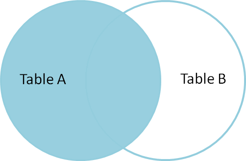

# Goals

- A gentle introduction to relational data.

# Setup

Tonight's lecture will start with an in-depth discussion of a topic I'm sure you all don't want to discuss, Covid-19. And, I get that. At the same time, I think it is important to connect what we are doing to reality. I also think it is important to connect what we are doing to real analysis tasks.

To do so, we will leverage a data set which has been made publicly available by the New York Times and is hosted on GitHub. Hosting data on platforms like GitHub has become popular which is both wonderful and weirdly nerdy. The New York Times and Five-Thirty-Eight are but two examples of publications which host most/all of their data publicly for further analysis and commentary.

Tonight, we will download this data, and then discover why we need ANOTHER data set to make the NY Times data useful.

The following code chunk will download the NYTimes County data from GitHub but it only keeps the New York State data, since that will be the focus of our discussion tonight. Unlike other data sets we have worked with in this class, this is REAL data. Next year, the data will be different from what we will look at tonight. It is possible, the answers to our questions will change as well. Welcome to the big leagues.

```{r}
rm(list = ls())
library(knitr)
library(lubridate) ## Yes, this is a real package, and yes, you will need to install it.
library(maps)
library(rvest)
library(tidyverse)
library(xml2)
source("R/get_county_pop.R")
options(scipen=999)

## County Grain Data --------------------------------------
## In class we worked with the state-grain data. Today, we
## will focus on the counties in a specific state.

## DATA ========================================================================
## Where to get our Covid 19 Data
data_url_county_covid <- "https://raw.githubusercontent.com/nytimes/covid-19-data/master/us-counties.csv"

## There's a lot going on here. Some of it should look familiar. Some of it won't.
## This is a public data set, but this sequence of commands makes it easier for us to work with.
## This imports the data and assigns it to a variable called county_covid.
county_covid <- 
  read_csv(data_url_county_covid) %>%
  filter(state == "New York") %>%
  select(state, county, fips, date, cases, deaths) %>%
  arrange(state, county, fips, date) %>%
  group_by(state, county, fips) %>%
  mutate(
    new_cases = cases - lag(cases, default = 0),
    new_deaths = deaths - lag(deaths, default = 0),
    fips = as.numeric(fips)
    ) %>%
  ungroup()

## Here, I'm just printing the data back to our notebook.
county_covid
```

For convenience, this adds two columns to the NY Times data, new_cases, and new_deaths which are unique daily values.

Our data contains about 20,000 rows. To review the data more thoroughly, you may do so by executing `view(county_covid)` in the console. This will open the data in a new tab and is a good way to look at a "novel" data set.

# Analysis

## Task 01

What counties have had the most cases of Covid-19 and how recent is our data?

- Group by county & fips code.
    - A FIPS county code is a five-digit number which identifies all counties and county equivalent geographic units in the United States.
    - Some states, like Louisiana use the term parish rather than county. 🤷
    - Counties in NY all start with a 36.
    - Albany County is 36001. Dutchess is 36027. Kings County is 36047 and is not part of our data set.
    - The New York Times reports cases/deaths for all five boroughs (New York, Kings, Queens, Bronx and Richmond counties) in a single geographical unit called New York City. New York City does not have a FIPS code because it is not a county equivalent.
    - All data is broken. Usually because of the humans.
- Just add up all the daily new cases, regardless of date for this task.

```{r}
## YOUR CODE HERE!

```

Conclusions:
- New York City has had by far the most cases, which is both obvious and idiotic.
- Why would anyone compare the five most populous counties in the state to any other individual county?
- As of right not, Dutchess and Albany counties have had a similar number of cases.

## Task 02

Which county, Dutchess or Albany NY has had more deaths per capita?

- In other words, controlling for population differences, which county has had more cases of Covid-19?
- Or, more formally, how may cases of Covid-19 have there been per 100,000 people in each county?
- We _can_ find the data we need/want on the New York State DOH Website. [Table 2: Population, Land Area, and Population Density by County, New York State - 2018](https://www.health.ny.gov/statistics/vital_statistics/2018/table02.htm)
    - Yes, 2018 numbers predate the pandemic.
    - Have I mentioned that all data is broken?
- But for whatever reason, this data is not available as a CSV.
- So we will have to do some web-scraping.
    - If you would like to see that code, you can see it in [get_data_pop](R/get_data_pop.R)
    - The web-scraping code is not part of this class, but I did want you to see it was possible.
- To actually do this, we need to JOIN our data with this DOH data.

## Minor detour into relational data

```{r}
## The function, get_county_pop is not a built-in command.
## It is in R/get_county_pop.R which we sourced in the Setup code chunk, 
## which means it is available for the entirey session.
county_pop <- get_county_pop()
county_pop
```

- PLEASE observe that both tibbles have a column called, "county".
- So, we _could_ just find the values of interest:

```{r}
my_two_counties <- c("Dutchess", "Albany") ## Do not repeat yourself. (DRY)
county_covid %>% filter(county %in% my_two_counties) %>% group_by(county) %>% summarize(tot_new_deaths = sum(new_deaths))
county_pop %>% filter(county %in% my_two_counties)
```

And then do the math manually in the console . . . . which completely misses the point of this course. And, if we do it the RIGHT way, we can learn so much more.

## LEFT JOIN

```{r}

```


```{r}
county_covid %>% 
  left_join(county_pop, by = "county")
```

- county_covid and the above table have the same number of rows.
- And we now have pop_estimate for every county, on every row.
    - That isn't really what we want, but it's useful ATM.

## INNER JOIN 

```{r}
include_graphics("includes/inner_join.png")
```

```{r}
county_covid %>% 
  inner_join(county_pop, by = "county")
```

- We just lost a bunch of rows . . . . 

## LEFT v INNER

```{r}
county_covid %>% 
  left_join(county_pop, by = "county") %>% 
  filter(is.na(pop_estimate_2018)) %>% 
  group_by(county) %>%
  summarize(n = n())
```

- There obviously isn't a county called Unknown in county_pop.
- And the spelling of St. Lawrence county was St Lawrence in county_pop.
- Joining on strings, like names, can be risky.
    - Imagine joining on something like a person's name.
    - Not imagine me ROTFLMAO
    - This doesn't work real well.
- Better to use codes MEANT for this.
- In an inner join, the joining factor MUST BE PRESENT IN BOTH TABLES.
- In a left join, the joining factor MUST BE PRESENT IN ONLY THE FIRST (left) TABLE.
    - This kind of logic comes with a built-in assumption you work/think in a RTL language.

```{r}
county_pop <- get_county_pop(fips = TRUE)
county_covid %>% 
  left_join(county_pop, by = "fips") %>%
  filter(county == "St. Lawrence")
```

By using a "key" a value intended to be used for matching across data sets, we were able to match, even though spelled differently.

These data sets have a relationship to one another:

- A related, but not identical grain.
- One or more common values, which can be used as a key to cross-reference across tables.

This idea is expanded upon in databases, which go even further and have internal keys, unique to that system, for cross-walking across tables which we will discuss next week.

### Back to Task 02

Which county, Dutchess or Albany NY has had more deaths per capita?

- We now, finally, have all the tools we need to solve this challenge, without resorting to manual mathematics.
- Remember, we use small steps to solve complex problems.
- Imagine how the data must be reshaped and think through each step.

```{r}
county_covid %>%
  group_by(county, fips) %>%
  summarize(total_cases = sum(new_cases)) %>%
  left_join(county_pop, by = "fips") %>%
  mutate(rate_cases = (total_cases/pop_estimate_2018)*100000) %>%
  arrange(desc(rate_cases))
```

Every time you do this:

- Understand the grain of BOTH tables.
    - Are there missing entries?
    - Are their duplicates?
- Find the keys which allow you to connect the tables.
- Do you want a left or an inner join?
